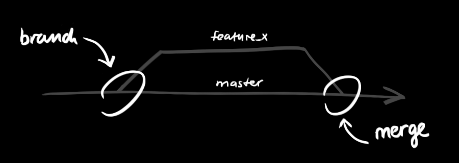

#Git Tutorial
<!--TOC-->
## Get Git
### Command Line Tool
[Download Official Command Line Client](http://git-scm.com/download)

### GUI Tool
[Download SourceTree GUI](http://www.sourcetreeapp.com)
[Download GitHub GUI for Mac](https://mac.github.com)
[Download GitHub GUI for Windows](https://windows.github.com)

## Getting Started with Git
***The assumption is that you are running all*** `commands` ***on the command line.***

### Creating an Initial Repository
Create a new directory, open it and perform a

```bash
git init
```

to create a new git repository.

### Checkout a Repository
Create a working copy of a local repository by running the command…

```bash
git clone /path/to/repository
```

When using a remote server, your command will be…

```bash
git clone username@host:/path/to/repository
```

### Workflow
Your local repository consists of three "trees" maintained by git. The first one is your working directory which holds the actual files. The second one is the Index which acts as a staging area and finally the HEAD which points to the last commit you've made.


### Add and Commit
You can propose changes (add it to the Index) using:

```bash
git add filename
git add *
```

This is the first step in the basic git workflow. To actually commit these changes use:

```bash
git commit -m "Commit message"
```

Now the file is committed to the HEAD, but not in your remote repository yet.

### Pushing Changes
Your changes are now in the HEAD of your local working copy. To send those changes to your remote repository, execute…

```bash
git push origin master
```

Change master to whatever branch you want to push your changes.

If you have not cloned an existing repository and want to connect your repository to a remote server, you need to add it with…

```bash
git remote add origin server
```

Now you are able to push your changes to the selected remote server.

### Branching
Branches are used to develop features isolated from each other. The master branch is the DEFAULT branch when you create a repository. Use other branches for development and merge them back to the master branch upon completion.



Create a new branch named "feature_x" and switch to it using…

```bash
git checkout -b feature_x
```

…switch back to master…

```bash
git checkout master
```

…and delete the branch again…

```bash
git branch -d feature_x
```

…a branch is not available to others unless you push the branch to your remote repository…

```bash
git push origin branch
```

### Update and Merge
To update your local repository to the newest commit, execute…

```bash
git pull
```

In your working directory to fetch and merge remote changes. To merge another branch into your active branch (e.g. master), use…

```bash
git merge branch
```

In both cases git tries to auto-merge changes. Unfortunately, this is not always possible and results in conflicts. You are responsible to merge those conflicts manually by editing the files shown by git. After changing, you need to mark them as merged with…

```bash
git add filename
```

Before merging changes, you can also preview them by using…

```bash
git diff source_branch target_branch
```

### Tagging
It's recommended to create tags for software releases. You can create a new tag named 1.0.0 by executing…

```bash
git tag 1.0.0 1b2e1d63ff
```

The `1b2e1d63ff` stands for the first 10 characters of the commit id you want to reference with your tag. You can get the commit id by looking at the…

### Log
In its simplest form, you can study repository history using `git log`. You can add a lot of parameters to make the log look like what you want. To see only the commits of a certain author…

```bash
git log --author=bob
```

To see a very compressed log where each commit is one line…

```bash
git log --pretty=oneline
```

Or mabe you want to see an ASCII art tree of all the branches, decorated with the names of tags and branches…

```bash
git log --graph --oneline --decorate --all
```

See only which files have changed…

```bash
git log --name-status
```

These are just a few of the possible parameters you can use. For more, see `git log --help`.

### Replace Local Changes
In case you did something wrong (which for sure never happens ;) you can replace local changes using the command…

```bash
git checkout -- filename
```

This replaces the changes in your working tree with the last content in HEAD. Changes already added to the index, as well as new files, will be kept. If you instead want to drop all your local changes and commits, fetch the latest history from the server and point your local master branch at it like this…

```bash
git fetch origin
git reset --hard origin/master
```

### Useful Hints
Builtin Git GUI…

```bash
gitk
```

Use colorful git output…

```bash
git config color.ui true
```

Show log on just one line per commit…

```bash
git config format.pretty oneline
```

Use interactive adding…

```bash
git add -i
```
