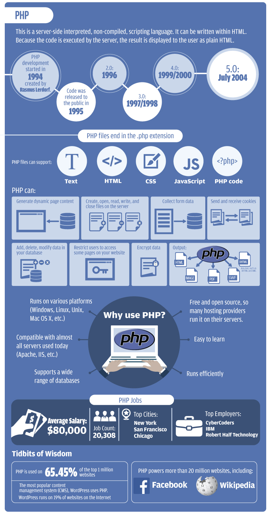

# Lecture 1
## Well, I am a 1337 H4xor and everyone knows PHP 5ux.

>There are only two kinds of programming languages: those people always [complain]† about and those nobody uses.
> — Bjarne Stroustrup
>†Salty language edited

That is a popular opinion and you would be in [very](http://eev.ee/blog/2012/04/09/php-a-fractal-of-bad-design/) [good](http://blog.codinghorror.com/the-php-singularity/) [company](http://www.marco.org/2012/06/29/php-addiction). However, PHP does have its [defenders](http://www.sitepoint.com/can-great-apps-written-php-interview-series/). The world must like PHP somewhat. It is the [6th most popular
programming language](http://www.tiobe.com/index.php/content/paperinfo/tpci/index.html) and the [most popular](http://php.net/usage.php) [server side scripting language](http://w3techs.com/technologies/details/pl-php/all/all).

PHP is a powerful language when it is used for what in the way is was meant to be used.

-   PHP is ubiquitous. Almost every hosting company provides PHP. As a matter of fact some provide only PHP. If you decide to setup your own web server, ever major distribution of linux’s base Apache install comes with PHP. Even Microsoft IIS make PHP trivial to install.
-   It is easy to get started. Other than having your own server or web hosting and a text editor, you do not really need anything else to code in PHP. Any text editor will do. VI, sure. Emacs, yep. Sublime Text, absolutely. Notepad, sure why not. There is no compiler, not project setup. No barrier to entry. Just put your files in the right place and you are off to the races.
-   Results are easily achieved. Have a page and want to add a dynamic element? Change the file extension and add a little PHP. You now have a dynamic page.
-   There is a large developer community. There is lots of help for your PHP projects. There are also lots of third party libraries. Also, PHP is very widely deployed. So much so that for your first years of development in PHP someone will have already figured out a solution to all of your problems.  Like they will posted it to their blog (or as an answer to a stack overflow question). There is also the [PHP Manual](http://www.php.net/manual/en/), fellow developers, a myriad of books. You will never be at a loss to find information about PHP.
-   It is cheap. Because it is everywhere, if you are developing a project for a business (or as a business), programming talent, support, and knowhow are readily available. The ubiquity of PHP drives the cost to market way down.

PHP is a good general purpose server side scripting language. It is likely good enough for most web project and will allow you to implement the principles of rapid application development.

It should be noted that it is poor for solving very specific issues:

 - Parallelization
 - High Speed Computing
 - Large Team Projects

If your programming a project and it does not fall into one of the above categories, PHP will most likely be a good language choice.

# History of PHP

The origins of PHP date back to 1995 when an independent software development contractor named Rasmus Lerdorf developed a Perl/CGI script that enabled him to know how many visitors were reading his online résumé. His script performed two tasks: logging visitor information, and displaying the count of visitors to the Web page. Because the Web as we know it today was still young at that time, tools such as these were nonexistent, and they prompted e-mails inquiring about Lerdorf’s scripts. Lerdorf thus began giving away his toolset, dubbed Personal Home Page (PHP).

[PHP 1.0 announcement posted to the Usenet newsgroup comp.infosystems.www.authoring.cgi in June 1995](http://groups.google.com/group/comp.infosystems.www.authoring.cgi/msg/cc7d43454d64d133)

The clamor for the PHP toolset prompted Lerdorf to continue developing the language, with perhaps the most notable early change being a new feature for converting data entered in an HTML form into symbolic variables, encouraging exportation into other systems. To accomplish this, he opted to continue development in C code rather than Perl. Ongoing additions to the PHP toolset culminated in November 1997 with the release of PHP 2.0, or Personal Home Page/Form Interpreter (PHP/FI). As a result of PHP’s rising popularity, the 2.0 release was accompanied by a number of enhancements and improvements from programmers worldwide.

The new PHP release was extremely popular, and a core team of developers soon joined Lerdorf. They kept the original concept of incorporating code directly alongside HTML and rewrote the parsing engine, giving birth to PHP 3.0. By the June 1998 release of version 3.0, more than 50,000 users were using PHP to enhance their Web pages.

## PHP 4

Development continued at a hectic pace over the next two years, with hundreds of functions being added and the user count growing in leaps and bounds. At the beginning of 1999, [Netcraft](http://www.netcraft.com), an Internet research and analysis company, reported a conservative estimate of a user base of more than 1 million, making PHP one of the most popular scripting languages in the world. Its popularity surpassed even the greatest expectations of the developers, as it soon became apparent that users intended to use PHP to power far larger applications than originally anticipated. Two core developers, Zeev Suraski and Andi Gutmans, took the initiative to completely rethink the way PHP operated, culminating in a rewriting of the PHP parser, dubbed the Zend scripting engine. The result of this work was in the PHP 4 release.

On May 22, 2000, roughly 18 months after the first official announcement of the new development effort, PHP 4.0 was released. Many considered the release of PHP 4 to be the language’s official debut within the enterprise development scene, an opinion backed by the language’s meteoric rise in popularity. Just a few months after the major release, Netcraft estimated that PHP had been installed on more than 3.6 million domains.

PHP 4 added several enterprise-level improvements to the language, including the following:

-   Improved resource handling: One of version 3.X’s primary drawbacks was scalability. This was largely because the designers underestimated how rapidly the language would be adopted for large-scale applications. The language wasn’t originally intended to run enterprise-class Web sites, and continued interest in using it for such purposes caused the developers to rethink much of the language’s mechanics in this regard.
-   Object-oriented support: Version 4 incorporated a degree of object-oriented functionality, although it was largely considered an unexceptional and even poorly conceived implementation. Nonetheless, the new features played an important role in attracting users used to working with traditional object-oriented programming (OOP) languages. Standard class and object development methodologies were made available in addition to features such as object overloading and run-time class information. A much more comprehensive OOP implementation has been made available in version 5.
-   Native session-handling support: HTTP session handling, available to version 3.X users through the third-party package PHPLIB (http: //phplib. sourceforge. net), was natively incorporated into version 4. This feature offers developers a means for tracking user activity and preferences with unparalleled efficiency and ease.
-   Encryption: The MCrypt (http: //mcrypt.[sourceforge.net](http://sourceforge.net)) library was incorporated into the default distribution, offering users both full and hash encryption using encryption algorithms including Blowfish, MD5, SHA1, and TripleDES, among others. Chapter 21 delves into PHP’s encryption capabilities.
-   ISAPI support: ISAPI support offered users the ability to use PHP in conjunction with Microsoft’s IIS Web server.
-   Native COM/DCOM support: Another bonus for Windows users is PHP 4’s ability to access and instantiate COM objects. This functionality opened up a wide range of interoperability with Windows applications.
-   Native Java support: In another boost to PHP’s interoperability, support for binding to Java objects from a PHP application was made available in version 4.0.
-   Perl Compatible Regular Expressions (PCRE) library: The Perl language has long been heralded as the reigning royalty of the string-parsing kingdom. The developers knew that powerful regular expression functionality would play a major role in the widespread acceptance of PHP and opted to simply incorporate Perl’s functionality rather than reproduce it, rolling the PCRE library package into PHP’s default distribution (as of version 4.2.0).
-   In addition to these features, literally hundreds of functions were added to version 4, greatly enhancing the language’s capabilities. Many of these functions are discussed throughout the course of the book.

PHP 4 represented a gigantic leap forward in the language’s maturity, offering new features, power, and scalability that swayed an enormous number of burgeoning and expert developers alike. Yet the PHP development team wasn’t content to sit on their hands for long and soon set upon another monumental effort, one that could establish the language as the 800-pound gorilla of the Web scripting world: PHP 5.

## PHP 5

Version 5 was yet another watershed in the evolution of the PHP language. Although previous major releases had enormous numbers of new library additions, version 5 contains improvements over existing functionality and adds several features commonly associated with mature programming language architectures:

-   Vastly improved object-oriented capabilities: Improvements to PHP’s object oriented architecture is version 5’s most visible feature. Version 5 includes numerous functional additions such as explicit constructors and destructors, object cloning, class abstraction, variable scope, and interfaces, and a major improvement regarding how PHP handles object management. Chapters 6 and 7 offer thorough introductions to this topic.
-   Try/catch exception handling: Devising custom error-handling strategies within structural programming languages is, ironically, error-prone and inconsistent. To remedy this problem, version 5 supports exception handling. Long a mainstay of error management in many languages, such as C++, C#, Python, and Java, exception handling offers an excellent means for standardizing your error-reporting logic.
-   Improved XML and Web Services support: XML support is now based on the libxml2 library, and a new and rather promising extension for parsing and manipulating XML, known as SimpleXML, has been introduced. In addition, a SOAP extension is now available.
-   Native support for SQLite: Always keen on choice, the developers added support for the powerful yet compact [SQLite](http://www.sqlite.org) database server. SQLite offers a convenient solution for developers looking for many of the features found in some of the heavyweight database products without incurring the accompanying administrative overhead.

